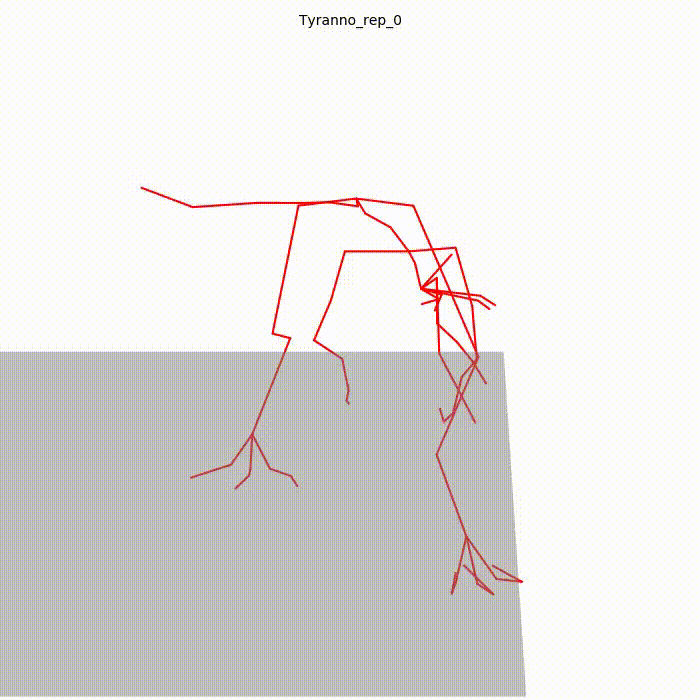

# Text2Motion


A tyrannosaurus attacks

**Text2Motion** is a deep learning system that translates text descriptions into realistic 3D animations for any given mesh. It automates complex animation workflows with an intelligent, three-stage pipeline:

1. *Classification*: The system first analyzes the input 3D mesh to identify its key features and determine the appropriate armature (skeleton).

2. *Skinning*: It then binds the mesh to the armature, creating a "skinned" model ready for realistic deformation.

3. *Generation*: Finally, a powerful diffusion model generates fluid and nuanced motion based on your text prompt, bringing the model to life.

-----

## Getting Started

Follow these instructions to get the project up and running on your local machine.

1. **Setup environment**

    To setup the environment, run the following code:

    ```bash
      conda env create -f environment.yaml
      conda activate text2motion
      pip install torch-scatter -f https://data.pyg.org/whl/torch-2.4.1+cu121.html
      pip install git+https://github.com/inbar-2344/Motion.git
    ```
2. **Download the dataset**

   This project uses the **Truebones Zoo dataset**, a collection of animated animal motions. You can get the dataset for free from the [Truebones Gumroad page](https://truebones.gumroad.com/l/skZMC).
   After downloading, extract the contents into a directory named `data` within the root of the project. The directory structure should look like this:

   ```
   text2motion/
   ├── data/
   │   └── Truebone_Z-OO/
   │       └── ... (dataset files)
   ├── dataset/
   ├── models/
   ├── scripts/
   ├── utils/
   ├── train_classifier_skinning.py
   ├── train_diffusion.py
   ```

3. **Preprocess the dataset**

   To prepare the dataset for training, you must run two distinct preprocessing steps: one for the classification and skinning models, and a second one for the diffusion model.

   ### Preprocessing for Classification and Skinning

   This first step is essential for the classification and skinning models and requires **[Blender](https://www.blender.org/download/)**. You will need to run a script from your terminal that automates the necessary operations within Blender.

   Open a terminal and execute the following command:

   ```bash
   blender --background --python scripts/preprocessing_script.py
   ```

   -----

   ### Preprocessing for the Diffusion Model

   The second step prepares the data specifically for training the **diffusion model**. To correctly preprocess the data for the diffusion model, please refer to the detailed documentation and scripts provided in the **[Anytop repository](https://www.google.com/search?q=https.anytop2025.github.io/Anytop-page/)**. You should then put the `truebones_processed` folder in `data`.
-----

## Usage

### Training the Models

The complete training process involves two distinct stages that must be run **in order**. Each stage trains a separate model that is essential for the final animation pipeline.

1.  **Train the Classifier and skinning model**
    This model learns to analyze a 3D mesh and predict its skeletal structure (armature) in the correct positions with a weight for each vertex.

    ```bash
    python -m train_classifier_skinning
    ```

3.  **Train the Diffusion Model**
    This model learns to generate the actual motion sequence from a text prompt, which is then applied to the skinned model. See the file `utils/parser_util.py`

    ```bash
    python -m train_diffusion --model_prefix NAME_MODEL --objects_subset bipeds --lambda_geo 1.0 --overwrite --balanced
    ```

-----

## Acknowledgments

* **[Truebones](https://truebones.gumroad.com/)** for providing the excellent and comprehensive Zoo dataset.
* **[Anytop](https://anytop2025.github.io/Anytop-page/)**, whose work provided the basis for our preprocessing scripts, visualization tools, and the core of our diffusion model.
* The authors of **[MDM](https://guytevet.github.io/mdm-page/)** for their insightful ideas that significantly influenced the architecture of our diffusion model.
* The **[RigNet](https://zhan-xu.github.io/rig-net/)** project for developing the `SkinNet` model, which we have adapted for our skinning process.
* The creators of **[PointNet++](https://arxiv.org/abs/1706.02413)** for the pioneering network architecture that underpins our classification and joint prediction models.

## License
This code is distributed under an [MIT LICENSE](LICENSE).
Note that our code depends on other libraries that have their own respective licenses that must also be followed.